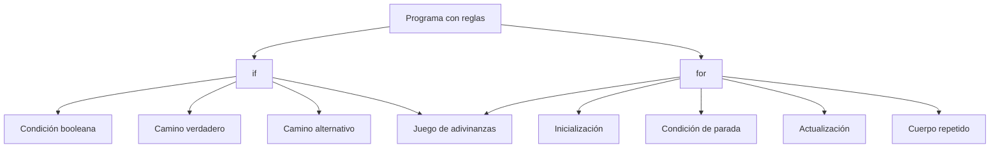

<p align="center">
  
</p>

<div align="center">

# Lección 03: Condiciones y bucles

### Reglas que deciden y acciones que se repiten

[](#)
[](#)
[](#)
[](#)
[](#)

</div>

> **Laboratorio principal:** Replit pendiente.  
> **Editor de respaldo:** OnlineGDB.

---

<p align="center">
  
</p>

## Punto de partida

El estudiante ya puede guardar datos; ahora necesita reglas. El curso introduce decisiones concretas: si una condición se cumple, se ejecuta un camino; si no, se ejecuta otro.

> **Analogía de la lección:** Un if funciona como un control de ingreso: revisa una condición y decide qué camino se abre. Un bucle es una rutina repetida con límite.

Antes de abrir Replit, mira el objetivo técnico de esta sesión: al terminar deberías poder **usar if/else y for para representar reglas y repeticiones simples**. No memorices cada palabra del código; identifica qué responsabilidad cumple cada bloque.

## Conceptos de la sesión

### Condición booleana
Una condición produce `true` o `false`. Java no acepta “casi verdadero”: la expresión debe poder evaluarse con claridad.

### `if` y `else`
`if` define qué pasa cuando la condición se cumple. `else` define el camino alternativo. Juntos evitan mensajes contradictorios.

### Bucle `for`
Un `for` repite una acción una cantidad conocida de veces. Puede servir para contar ejercicios, revisar intentos, recorrer turnos o repetir una pregunta.

### Contador
El contador permite saber en qué repetición estamos. Nombrarlo `attempt` ayuda más que usar una letra sin contexto.

## Lectura guiada de código

Sigue el flujo como si fuera una ruta: inicia el contador, revisa la condición del bucle, entra al bloque, evalúa el if y decide si continúa o se detiene.

El siguiente ejemplo está mal a propósito. En un curso para principiantes, ver el error primero ayuda a entender la regla.

~~~java
public class Main {
    public static void main(String[] args) {
        int grade = 14;
        if (grade = 11) {
            System.out.println("Aprobado");
        }
    }
}
~~~

**Qué ocurre:** El signo = asigna, no compara. Una condición necesita una expresión booleana como grade >= 11 o guess == secretNumber.

Ahora observa una versión correcta y mínima:

~~~java
public class Main {
    public static void main(String[] args) {
        int secretNumber = 7;
        int guess = 7;

        for (int attempt = 1; attempt <= 5; attempt++) {
            if (guess == secretNumber) {
                System.out.println("Intento " + attempt + ": número correcto.");
                break;
            } else {
                System.out.println("Intento " + attempt + ": sigue practicando.");
            }
        }
    }
}
~~~

### Señales que debes reconocer

- La estructura principal se mantiene estable.
- Los nombres comunican intención.
- El código se puede ejecutar en Replit sin instalación local.
- El ejemplo prepara una habilidad que luego se puede reutilizar en programas más completos.

## Pausa de comprensión

Responde en una libreta o en un comentario del Repl:

1. ¿Qué línea produce el resultado visible?
2. ¿Qué parte del código no deberías modificar todavía?
3. ¿Qué error sería más fácil de cometer en esta lección?

## Antes de decidir: pensar como regla

Un programa sin condiciones siempre recorre el mismo camino. Eso sirve para una primera clase, pero limita cualquier sistema real. Un juego, un formulario, un menú, una alarma o una calculadora necesitan decidir.

La pregunta central de esta lección no es "cómo escribo un `if`". La pregunta más útil es:

> **¿Qué condición debe cumplirse para que el programa tome este camino y no otro?**

Esa pregunta obliga a separar tres ideas:

| Idea | Pregunta de diseño | Ejemplo en lenguaje natural |
|---|---|---|
| Dato | ¿Qué información tengo? | Un número escrito por el usuario. |
| Regla | ¿Qué comparación debo hacer? | Si el número elegido es igual al secreto. |
| Acción | ¿Qué pasa si la regla se cumple? | Mostrar un mensaje de acierto y terminar. |

Cuando estas tres ideas se mezclan, el código empieza a ser difícil de leer. Por eso conviene escribir primero la regla en español y luego traducirla a Java.

```text
Si el número ingresado es igual al valor esperado,
entonces mostrar "Correcto".
En caso contrario,
mostrar "Intenta otra vez".
```

La traducción básica queda así:

```java
if (guess == secretNumber) {
    System.out.println("Correcto");
} else {
    System.out.println("Intenta otra vez");
}
```

Observa que Java no usa la palabra "si"; usa `if`. Tampoco usa "en caso contrario"; usa `else`. La estructura cambia de idioma, pero la lógica es la misma.

## Condiciones como preguntas cerradas

Una condición en Java debe responder con `true` o `false`. No responde con "más o menos", "quizá" o "depende". Eso la hace parecida a una pregunta cerrada.

| Pregunta humana | Condición en Java | Resultado posible |
|---|---|---|
| ¿La edad es mayor o igual a 13? | `age >= 13` | `true` o `false` |
| ¿El nombre es igual a "Ana"? | `name.equals("Ana")` | `true` o `false` |
| ¿El puntaje llegó a 100? | `score >= 100` | `true` o `false` |
| ¿El intento coincide con el número secreto? | `guess == secretNumber` | `true` o `false` |

En esta lección se trabajará sobre todo con números. Por eso usarás operadores como `==`, `!=`, `<`, `<=`, `>` y `>=`.

> **Consejo técnico:** para comparar números se usa `==`. Para comparar texto, más adelante conviene usar `.equals(...)`. Java distingue estos casos porque los tipos de datos no se comportan igual internamente.

## Operadores de comparación

Los operadores de comparación son símbolos pequeños, pero tienen consecuencias grandes. Un solo símbolo puede cambiar completamente la regla.

| Operador | Se lee como | Ejemplo | Cuándo devuelve `true` |
|---|---|---|---|
| `==` | igual a | `guess == 7` | Cuando `guess` vale 7. |
| `!=` | diferente de | `guess != 7` | Cuando `guess` no vale 7. |
| `<` | menor que | `age < 18` | Cuando `age` es 17 o menos. |
| `<=` | menor o igual que | `age <= 18` | Cuando `age` es 18 o menos. |
| `>` | mayor que | `score > 50` | Cuando `score` es 51 o más. |
| `>=` | mayor o igual que | `score >= 50` | Cuando `score` es 50 o más. |

El error más común es confundir `=` con `==`.

```java
int secretNumber = 7;
int guess = 3;

if (guess = secretNumber) {
    System.out.println("Correcto");
}
```

Ese código no compara. Intenta asignar. Java espera una condición booleana, pero recibe una operación de asignación con enteros.

La versión correcta es:

```java
int secretNumber = 7;
int guess = 3;

if (guess == secretNumber) {
    System.out.println("Correcto");
}
```

## El bloque `if`

Un `if` tiene tres partes visibles:

```java
if (condition) {
    instruction;
}
```

| Parte | Función |
|---|---|
| `if` | Indica que empieza una decisión. |
| `(condition)` | Pregunta que Java evaluará como `true` o `false`. |
| `{ ... }` | Bloque que se ejecuta si la condición es verdadera. |

Aunque el bloque tenga una sola línea, es buena práctica mantener llaves. Las llaves reducen errores cuando luego agregas más instrucciones.

Código frágil:

```java
if (score >= 100)
    System.out.println("Nivel completado");
    System.out.println("Siguiente misión desbloqueada");
```

El segundo mensaje parece pertenecer al `if`, pero realmente se ejecuta siempre. Para un principiante, esa ambigüedad genera errores silenciosos.

Código claro:

```java
if (score >= 100) {
    System.out.println("Nivel completado");
    System.out.println("Siguiente misión desbloqueada");
}
```

## El bloque `else`

`else` representa el camino alternativo. No tiene condición propia porque depende del `if` anterior.

```java
if (energy > 0) {
    System.out.println("Puedes continuar.");
} else {
    System.out.println("Necesitas descansar.");
}
```

La regla completa sería:

```text
Si la energía es mayor que cero, el usuario puede continuar.
Si no, necesita descansar.
```

El `else` evita que el programa muestre dos mensajes incompatibles al mismo tiempo.

Código incorrecto por mensajes contradictorios:

```java
int energy = 0;

if (energy > 0) {
    System.out.println("Puedes continuar.");
}

System.out.println("Necesitas descansar.");
```

Aquí el segundo mensaje aparece siempre. La solución es convertirlo en alternativa:

```java
int energy = 0;

if (energy > 0) {
    System.out.println("Puedes continuar.");
} else {
    System.out.println("Necesitas descansar.");
}
```

## `else if`: más de dos caminos

A veces una regla no tiene solo dos caminos. Por ejemplo, un puntaje puede ser bajo, medio o alto.

```java
int score = 75;

if (score >= 90) {
    System.out.println("Resultado excelente.");
} else if (score >= 60) {
    System.out.println("Resultado suficiente.");
} else {
    System.out.println("Necesita práctica.");
}
```

El orden importa. Java evalúa desde arriba hacia abajo. Si la primera condición verdadera aparece, ejecuta ese bloque y salta el resto.

Ejemplo mal ordenado:

```java
int score = 95;

if (score >= 60) {
    System.out.println("Resultado suficiente.");
} else if (score >= 90) {
    System.out.println("Resultado excelente.");
}
```

Aunque `score` vale 95, el programa imprime "Resultado suficiente" porque `score >= 60` ya era verdadero. La condición más específica debe ir primero.

## Bucles: repetir con propósito

Un bucle permite ejecutar una acción más de una vez. Sin bucles, tendrías que copiar y pegar instrucciones.

Código repetitivo:

```java
System.out.println("Intento 1");
System.out.println("Intento 2");
System.out.println("Intento 3");
System.out.println("Intento 4");
System.out.println("Intento 5");
```

Este enfoque funciona, pero no escala. Si mañana necesitas 20 intentos, tendrías 20 líneas casi iguales.

Con un `for`:

```java
for (int attempt = 1; attempt <= 5; attempt++) {
    System.out.println("Intento " + attempt);
}
```

La repetición queda expresada como regla:

```text
Empieza en 1.
Repite mientras el intento sea menor o igual a 5.
Después de cada vuelta, aumenta el intento en 1.
```

## Anatomía de un `for`

```java
for (int attempt = 1; attempt <= 5; attempt++) {
    System.out.println("Intento " + attempt);
}
```

| Parte | Nombre | Qué hace |
|---|---|---|
| `int attempt = 1` | Inicialización | Crea el contador y le da valor inicial. |
| `attempt <= 5` | Condición | Decide si el bucle continúa. |
| `attempt++` | Actualización | Aumenta el contador al final de cada vuelta. |
| `{ ... }` | Cuerpo | Contiene la acción repetida. |

Una forma de leerlo sin código es:

> Para cada intento desde 1 hasta 5, muestra el número de intento.

## Trazar un bucle en tabla

Trazar significa seguir el valor de las variables paso a paso. Es una habilidad importante porque ayuda a encontrar errores sin adivinar.

Para este bucle:

```java
for (int attempt = 1; attempt <= 3; attempt++) {
    System.out.println("Intento " + attempt);
}
```

La tabla sería:

| Vuelta | Valor de `attempt` al entrar | ¿`attempt <= 3`? | Mensaje |
|---|---:|---|---|
| 1 | 1 | `true` | Intento 1 |
| 2 | 2 | `true` | Intento 2 |
| 3 | 3 | `true` | Intento 3 |
| 4 | 4 | `false` | No entra |

La cuarta fila no imprime nada. Solo muestra que Java revisa la condición una vez más antes de terminar.

## `break`: salir antes del límite

Un bucle puede tener un límite máximo, pero a veces el objetivo se cumple antes. En un juego de adivinanzas, si el jugador acierta en el intento 2, no tiene sentido seguir hasta el intento 5.

```java
int secretNumber = 7;
int guess = 7;

for (int attempt = 1; attempt <= 5; attempt++) {
    if (guess == secretNumber) {
        System.out.println("Correcto en el intento " + attempt);
        break;
    }

    System.out.println("Todavía no.");
}
```

`break` corta el bucle actual. No termina todo Java; termina esa repetición.

Usa `break` con criterio. Si aparece en demasiados lugares, el flujo puede volverse difícil de seguir.

## Bucle sin salida

Un bucle sin salida ocurre cuando la condición nunca deja de cumplirse.

```java
for (int attempt = 1; attempt <= 5; attempt--) {
    System.out.println("Intento " + attempt);
}
```

El error está en `attempt--`. El contador baja: 1, 0, -1, -2. Como esos valores siempre son menores o iguales que 5, el bucle no termina.

La versión correcta es:

```java
for (int attempt = 1; attempt <= 5; attempt++) {
    System.out.println("Intento " + attempt);
}
```

## Decisión dentro de repetición

La combinación más importante de esta lección es usar un `if` dentro de un `for`.

```java
int secretNumber = 4;

for (int attempt = 1; attempt <= 5; attempt++) {
    int guess = attempt;

    if (guess == secretNumber) {
        System.out.println("Acierto en el intento " + attempt);
        break;
    } else {
        System.out.println("Intento " + attempt + ": " + guess + " no es correcto.");
    }
}
```

Este ejemplo simula intentos sin pedir entrada por consola. En una clase introductoria es razonable separar primero la lógica de repetición y después añadir lectura con `Scanner`.

## Entrada por consola con `Scanner`

Cuando el programa necesita leer una respuesta del usuario, se puede usar `Scanner`.

```java
import java.util.Scanner;

public class Main {
    public static void main(String[] args) {
        Scanner scanner = new Scanner(System.in);

        System.out.print("Ingresa un número: ");
        int guess = scanner.nextInt();

        System.out.println("Elegiste " + guess);
    }
}
```

Detalles importantes:

| Línea | Razón |
|---|---|
| `import java.util.Scanner;` | Permite usar la clase `Scanner`. |
| `new Scanner(System.in)` | Conecta el programa con la entrada de consola. |
| `scanner.nextInt()` | Lee un número entero escrito por el usuario. |

En Replit, la consola permite escribir el valor después de presionar **Run**.

## Error común con `Scanner`

Si el programa espera un entero y el usuario escribe texto, Java no puede convertirlo automáticamente.

```text
Exception in thread "main" java.util.InputMismatchException
```

Este error no significa que Java esté "mal". Significa que el dato ingresado no coincide con lo que el programa esperaba.

Para esta etapa, la solución pedagógica será simple:

> El laboratorio pedirá ingresar números enteros. Si se escribe texto, se vuelve a ejecutar el programa.

Más adelante se puede validar entrada con técnicas adicionales. En este curso introductorio conviene no mezclar demasiadas reglas nuevas en una sola sesión.

## Diseño de mensajes

Los mensajes de consola también forman parte del programa. Un mensaje claro ayuda a que el usuario entienda qué debe hacer.

Mensaje débil:

```java
System.out.println("Error");
```

Mensaje más útil:

```java
System.out.println("El número debe estar entre 1 y 10.");
```

Mensaje útil para juego:

```java
System.out.println("Intento " + attempt + " de 5. Ingresa un número entre 1 y 10:");
```

Un buen mensaje responde:

- Qué pasó.
- Qué dato se espera.
- Qué puede hacer el usuario.

## Mapa mental de la lección



Si tu visor Markdown no renderiza Mermaid, lee el bloque como texto: la idea central es que `if` decide y `for` repite.

## Mini caso: control de acceso

Imagina una puerta con un guardia. El guardia no conversa con la puerta; aplica una regla.

```text
Si la persona tiene entrada,
puede ingresar.
Si no tiene entrada,
debe comprar una.
```

En Java:

```java
boolean hasTicket = true;

if (hasTicket) {
    System.out.println("Acceso permitido.");
} else {
    System.out.println("Debe comprar una entrada.");
}
```

La variable `hasTicket` ya es booleana. Por eso no necesita compararse con `true`.

Código innecesario:

```java
if (hasTicket == true) {
    System.out.println("Acceso permitido.");
}
```

Código más limpio:

```java
if (hasTicket) {
    System.out.println("Acceso permitido.");
}
```

## Mini caso: semáforo de riesgo

Un semáforo de riesgo permite practicar `else if`.

```java
int temperature = 8;

if (temperature <= 4) {
    System.out.println("Riesgo alto: producto demasiado frío.");
} else if (temperature <= 8) {
    System.out.println("Rango seguro.");
} else {
    System.out.println("Riesgo alto: producto demasiado caliente.");
}
```

Este caso se parece a sistemas reales: una regla técnica clasifica datos y produce una acción.

## Mini caso: repeticiones limitadas

```java
int maxAttempts = 3;

for (int attempt = 1; attempt <= maxAttempts; attempt++) {
    System.out.println("Intento " + attempt + " de " + maxAttempts);
}
```

Usar `maxAttempts` mejora el código porque evita repetir el número 3 en varios lugares.

Versión menos mantenible:

```java
for (int attempt = 1; attempt <= 3; attempt++) {
    System.out.println("Intento " + attempt + " de 3");
}
```

Si cambias los intentos a 5, debes recordar editar dos lugares. Con una variable, cambias uno.

## Checklist técnico

Antes de pasar a la práctica, verifica que puedes explicar:

- Qué significa que una condición sea booleana.
- Por qué `=` no sirve para comparar.
- Qué camino ejecuta el `else`.
- Por qué un `for` necesita contador, condición y actualización.
- Qué problema resuelve `break`.
- Qué error aparece si falta una llave.
- Qué diferencia hay entre repetir código y usar un bucle.

## Material externo opcional

- Replit se usará como editor principal porque permite ejecutar desde el navegador.
- Dev.java y Oracle Java Tutorials se usan como referencia técnica para validar sintaxis y conceptos.
- JDoodle u OnlineGDB quedan como respaldo si Replit no carga durante la sesión.

---

<div align="center">

**Siguiente:** [Laboratorio en Replit](part-02-practice.md)

</div>


